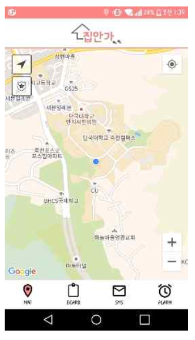
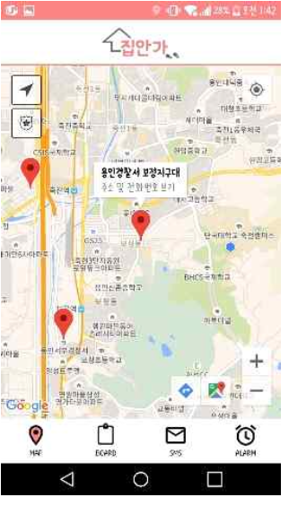
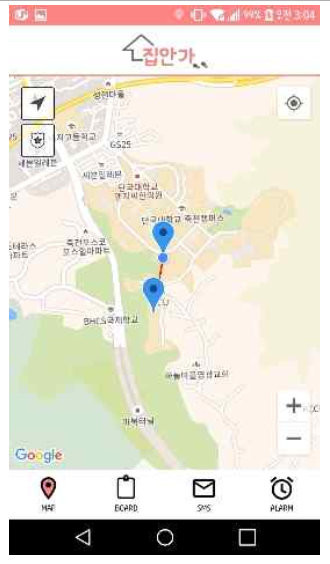
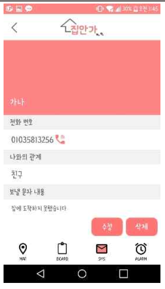

# AOS-Jib-anga

집안가(집에 안전하게 가자) 안드로이드 앱입니다. 지도를 제공하고, 집에 안전하게 도착할 수 있도록 도와주는 서비스를 제공합니다. 볼륨 버튼 아래키를 3초이상 누르면 저장된 번호로 문자가 전송됩니다. 또한, 출발지와 도착지를 설정하면 시간을 계산하여 제시간 안에 도착하지 못하면 문자가 전송됩니다. 근처 경찰서나 지구대가 마커에 표시되며, 게시판 기능이 있어 치안 관련 기사를 게시합니다.  

## 구현 기능

### 지도

Google 지도 api를 사용하여 현재 위치를 표시합니다. 또한 출발지/도착지를 설정하여 알림 전송기능을 사용할 수 있습니다. 출발지/도착지를 설정하면 거리를 계산하여 예상 시간을 표시합니다. 시간안에 도착했는데 사용자가 타이머를 종료하지 않으면, 저장해둔 번호로 SMS를 전송합니다.

### 주변 경찰서 정보

sqlite를 사용하여 주변 지구대, 경찰서 등의 정보를 담아 마커를 표시합니다. 마커를 클릭하면 경찰서 위치, 전화번호가 표시됩니다.

### 메세지 전송

위급한 상황에서 메세지 발송을 위해 설정하는 곳입니다. 전화번호와 보낼 문구를 저장하면, 볼륨 아래키를 3초동안 누르거나, 도착지에 시간안에 도착하지 못하면 저장해둔 번호로 저장한 문구가 SMS로 전송됩니다. 해당 데이터는 sqlite를 사용하여 저장합니다.

### 게시판 기능

공지사항, 버전정보, 치안 관련 기사를 저장합니다. 서버를 구현없이 sqlite에 데이터를 저장하여 표시하였습니다.
